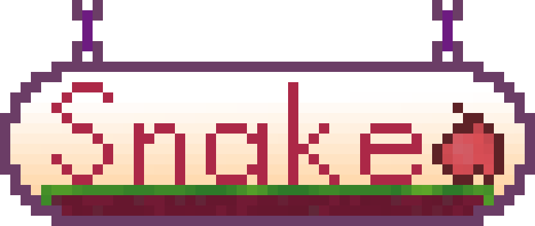
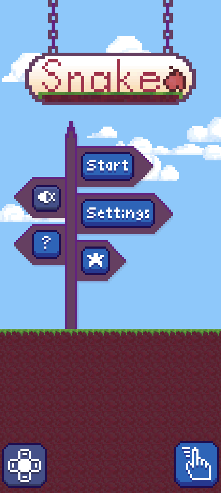
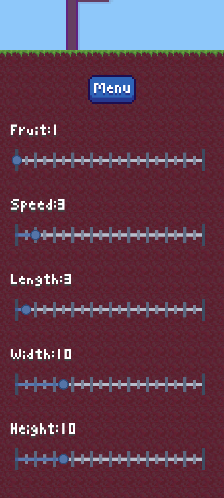
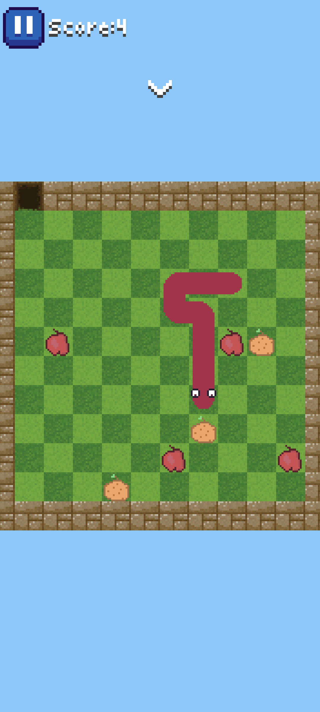
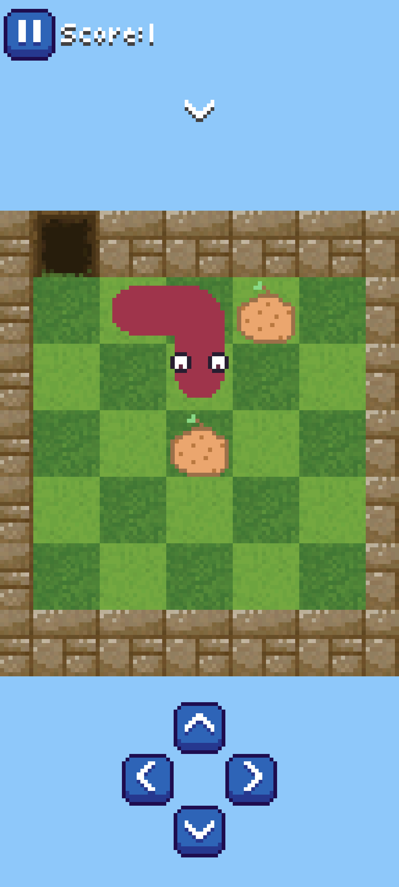
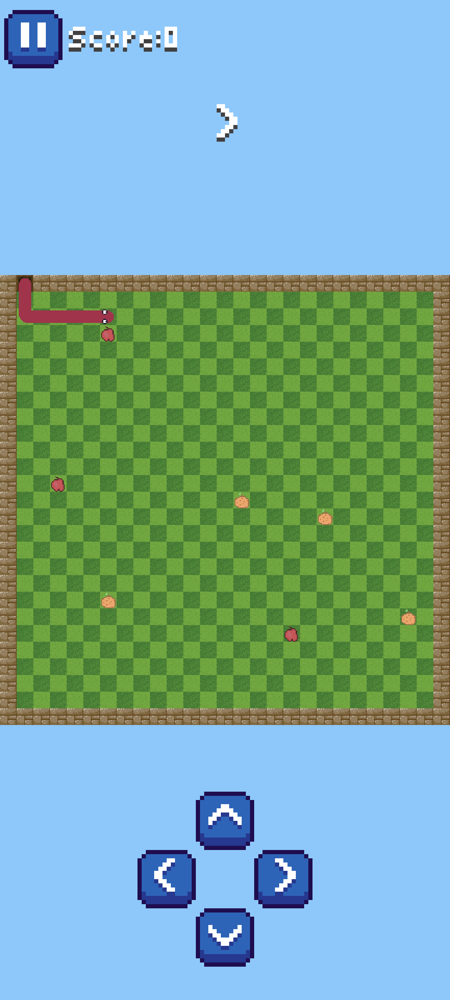
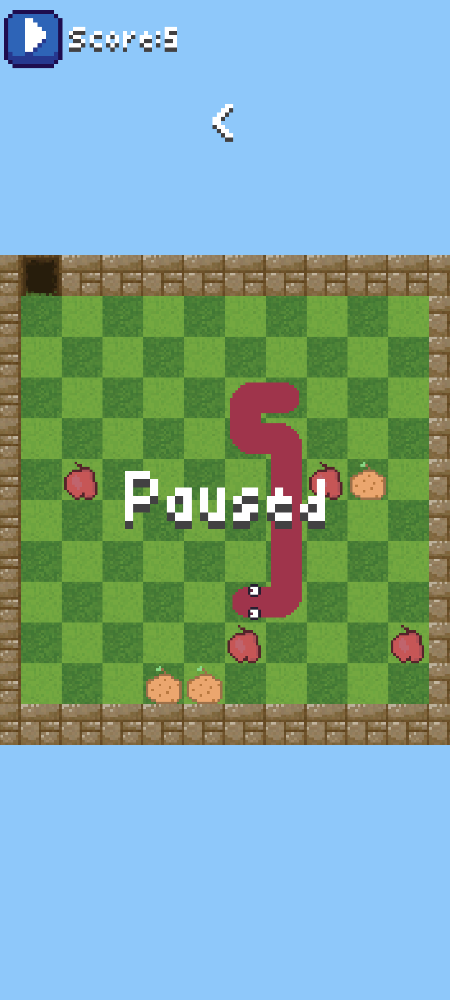
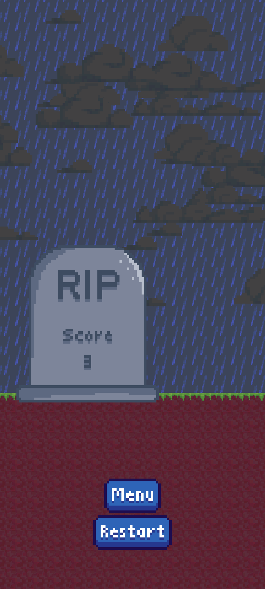

# Snake Game

This is a classic Snake game which I developed for Android using Java. Like the original the goal is to eat the fruit to grow longer while avoiding the walls and your own tail.

## Features

- **Multiple control schemes for movement -** *Those being swipe controls and arrow buttons*

- **Score system -** *A score is kept at the top of the screen increasing with each fruit ate by the snake. At the end of the game the tombstone displays the users final score*

- **Pause button -** *A pause button can stop the game and resume it again when pressed*

- **Variable map size -** *The user can change the height and width of the map independantly*

- **Variable snake speed -** *The user can change the speed of the snakes movements, which either increases or decreases the diffuculty of the game*

- **Variable fruit numbers -** *The number of fruit on the map can be changed by the user*

- **Variable starting length -** *The snakes starting length can be altered by the user*

## Screenshots

  
  
  
  
  
  
  

## Demo

## Installation

To play the game the release apk can be downloaded and installed onto your android device.

**[Find the apk file here](https://github.com/benjaminsanderswyatt/SnakeGame/blob/master/app/release/app-release.apk)**

## Assets & Artwork

All the artwork, animations, and assets used in this game, including backgrounds and character sprites were created by myself.
